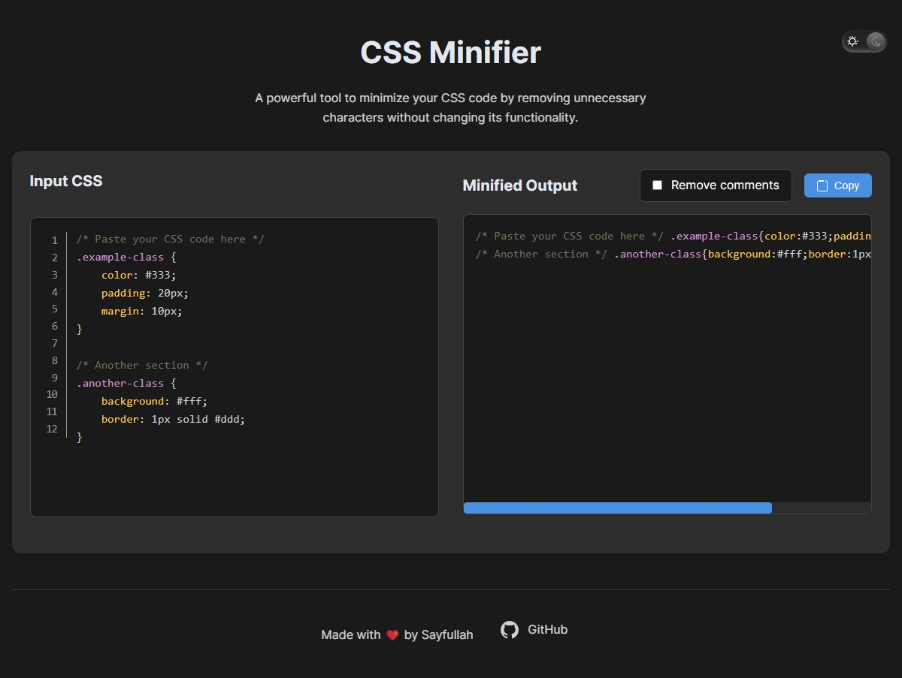

# CSS Minifier

A powerful, browser-based CSS minification tool that helps reduce your CSS file size by removing unnecessary characters without changing its functionality.

## 🚀 Features

- **Live Minification**: Instantly minifies CSS code as you type
- **Comment Control**: Option to remove or preserve CSS comments
- **Syntax Highlighting**: Beautiful code highlighting for better readability
- **Preserve Functionality**: Maintains the original CSS behavior while reducing file size

## 🎯 Usage

1. Visit the [CSS Minifier](https://minicss.zneloy.site/)
2. Paste your CSS code into the input section
3. The minified version will automatically appear in the output section
4. Toggle "Remove comments" checkbox to control comment preservation
5. Click the "Copy" button to copy the minified CSS to your clipboard

## ✨ How It Works

The minifier performs several optimizations:
- Removes unnecessary whitespace
- Removes line breaks
- Removes comments (optional)
- Optimizes CSS declarations

## 🤝 Contributing
Contributions, issues, and feature requests are welcome! Feel free to check the issues page.

## ⭐️ Show your support
Give a ⭐️ if this project helped you!

## 📝 License
This project is MIT licensed.
